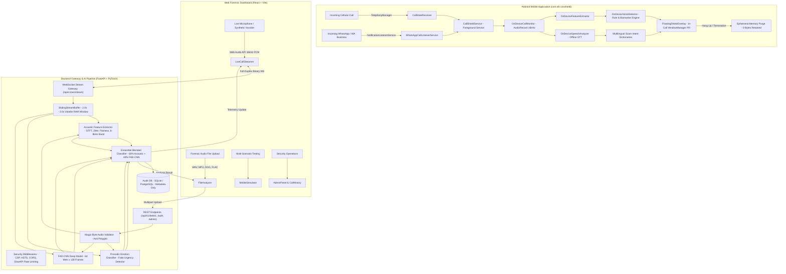

# VoxShield AI 🛡️
### Real-Time Voice Deepfake & AI Voice Cloning Defense System
**Smart India Hackathon (SIH) • Problem Statement: SIH26104**  
*Dual-Surface Architecture: Native Android Mobile Shield + React Web Dashboard + Forensic AI Gateway*

---

## 📌 Executive Summary

**VoxShield AI** is an enterprise-grade, privacy-first cybersecurity system engineered to detect and neutralize synthetic voice clones, AI-generated audio deepfakes, and telephone fraud in real time.

With the rapid proliferation of zero-shot voice cloning technologies (ElevenLabs, VALL-E, HiFi-GAN, SpeechT5) and the surge in high-impact cyber extortion schemes—such as **"Digital Arrest" police impersonations, customs contraband scams, and emergency kidnapping fraud**—VoxShield AI delivers an automated defensive perimeter.

VoxShield operates across a **dual-surface deployment**:
1. **Native Android Application (`com.sih.voxshield`)**: Intercepts incoming cellular and WhatsApp VoIP calls automatically, executing 100% on-device acoustic inference and offline multilingual scam intent detection with zero cloud audio transmission.
2. **Web Forensic Operations Center (`frontend`)**: Provides full-duplex WebSocket live stream inspection, deep forensic Log-Mel spectrogram visualization, smartphone simulation, and an auditable administrative security console.
3. **High-Performance Forensic Gateway (`backend`)**: Asynchronous FastAPI microservice powered by an ensemble classifier combining acoustic signal physics with a convolutional neural network (FAD-CNN) operating on Log-Mel spectrograms.

---

## 🏛️ System Architecture



---

## ⚡ Core Capabilities & Feature Matrix

| Capability / Feature | Android Mobile App | Web SOC Dashboard | Backend Forensic Engine |
| :--- | :---: | :---: | :---: |
| **Incoming Phone Call Interception** | ✅ Native Telephony (`ACTION_PHONE_STATE`) | N/A (Web sandbox) | N/A |
| **WhatsApp & WhatsApp Business VoIP** | ✅ `NotificationListenerService` | N/A (Web sandbox) | N/A |
| **In-Call Draggable Shield Overlay** | ✅ `FloatingShieldOverlay` (`SYSTEM_ALERT_WINDOW`) | ✅ In-HUD Floating Pill | N/A |
| **100% On-Device Offline Inference** | ✅ Zero Cloud Latency / Privacy Guard | N/A (Client-to-Gateway) | N/A |
| **Full-Duplex Real-Time Audio Streaming**| ✅ Native Buffer | ✅ WebSocket (16-bit Linear PCM) | ✅ Asynchronous Sliding Ring Buffer |
| **Synthetic AI Vocoder Simulator** | ✅ Hardware Mock Scenarios | ✅ Client-Side AudioContext Synthesizer | N/A |
| **High-Frequency Vocoder Band (6–8 kHz)**| ✅ On-Device FFT | ✅ Real-Time Telemetry Indicator | ✅ Discrete STFT Ratio Analyzer |
| **Spectral Flatness Biomarker** | ✅ Phase Noise Metric | ✅ Live Telemetry Indicator | ✅ Scipy Frequency Distribution |
| **Pitch Jitter & Regularity Tracking** | ✅ Dynamic Jitter Factor | ✅ Telemetry Indicator | ✅ Autocorrelation Peak Jitter |
| **Prosodic Emotion Classification** | ✅ 6 States (Panic, Coercion, etc.) | ✅ Live Emotion Badge | ✅ Acoustic Energy + $F_0$ Variance |
| **Synthetic "Fake Urgency" Flagging** | ✅ Monotone shouting detection | ✅ Incongruence Alert Banner | ✅ $\sigma_{F_0} < 16\text{ Hz}$ with high RMS |
| **Multilingual Scam Intent Recognition** | ✅ Marathi, Hindi, English (Offline) | ✅ Scenario Corpora Simulator | N/A |
| **FAD-CNN Mel-Spectrogram Model** | Optional Cloud Key | ✅ Deep Probabilities Displayed | ✅ 64 Mel Bands × 128 Time Frames |
| **Interactive Canvas Spectrogram** | N/A | ✅ Magma dBFS Colormap Canvas | N/A |
| **Audio File Inspection (Forensics)** | N/A | ✅ WAV, MP3, OGG, FLAC (10 MB) | ✅ Magic Byte MIME Validation |
| **Step-Up Out-of-Band Verification** | ✅ Verification Trigger | ✅ Interactive Modal (SMS/Callback) | ✅ Cryptographic Verification Log |
| **Ephemeral Volatile RAM Guarantee** | ✅ **0 Bytes Written to Disk** | ✅ **0 Bytes Stored Locally** | ✅ **Immediate Garbage Collection** |
| **Role-Based Access Control (RBAC)** | N/A | ✅ User vs. Admin Views | ✅ JWT with bcrypt + Role Claims |
| **Dynamic Threshold Sliders** | Synchronized | ✅ Admin Panel Live Controls | ✅ Database-Backed Hot Reload |

---

## 🔬 Deepfake Forensic Pipeline & Detection Physics

Synthetic speech engines and neural vocoders (HiFi-GAN, WaveNet, MelGAN, BigVGAN, ElevenLabs) leave mathematical and acoustic signatures that biological human vocal cords do not produce:

### 1. High-Frequency Vocoder Band Energy Ratio (6 kHz – 8 kHz)
- **Physics**: Human vocal tracts naturally attenuate acoustic energy at frequencies exceeding 6 kHz due to pharyngeal tissue absorption. Neural vocoders synthesizing waveforms via inverse Short-Time Fourier Transform (iSTFT) or GAN upsampling generators exhibit unnatural energy spillover and phase noise in the 6 kHz – 8 kHz band.
- **Metric**:
  $$\text{HF Ratio} = \frac{\sum_{f=6000}^{8000} |X(f)|^2}{\sum_{f=0}^{8000} |X(f)|^2}$$

### 2. Spectral Flatness & Phase Noise
- **Physics**: White noise and phase discrepancies across frequency bins quantify the vocoder's inability to synthesize continuous resonant harmonics.
- **Metric**: Geometric mean of the power spectrum divided by the arithmetic mean. High spectral flatness indicates synthetic noise injection.

### 3. Fundamental Frequency ($F_0$) & Pitch Jitter Regularity
- **Physics**: Natural human speech exhibits micro-perturbations in cycle-to-cycle frequency ($0.05 \le \text{Jitter} \le 0.40$).
  - **Jitter $< 0.05$**: Unnaturally static, robotic pitch characteristic of concatenation or linear TTS.
  - **Jitter $> 0.85$**: Micro-phase glitches and audio splicing artifacts.

### 4. Prosodic Emotion Classification & "Fake Urgency" Incongruence
Scammers utilizing cloned voices often attempt high-pressure coercion (e.g., screaming about an urgent arrest or accident).
- VoxShield classifies vocal emotion into 6 acoustic states:
  1. **Panic / Extreme Urgency** (Elevated energy + $F_0 > 240\text{ Hz}$)
  2. **High Pressure / Coercion** (Aggressive volume + $F_0 > 200\text{ Hz}$)
  3. **Agitated / Distressed** (Pitch volatility $\sigma_{F_0} > 40\text{ Hz}$)
  4. **Monotone / Flat Affect** ($\sigma_{F_0} < 14\text{ Hz}$ with sustained vocalization)
  5. **Whisper / Low Energy** ($\text{RMS} < 0.02$)
  6. **Calm / Neutral** (Natural conversational prosody)
- **Synthetic Emotion Incongruence Flag**: When a speaker's audio exhibits loud, urgent acoustic energy but the pitch variance remains unnaturally flat ($\sigma_{F_0} < 16\text{ Hz}$), VoxShield flags the call:
  > *"Fake Urgency Detected: Monotone pitch with forced urgency (AI Voice Clone Signature)."*

### 5. FAD-CNN Deep Learning Architecture
- Pretrained deep convolutional neural network evaluating 64 Log-Mel filterbank channels over 128 temporal frames ($64 \times 128$).
- Multi-layer 2D convolutional feature extraction with batch normalization, ReLU activation, spatial max-pooling, adaptive average pooling, and dropout ($p = 0.3$).
- **Ensemble Blending**:
  $$\text{Risk Score} = 0.60 \times (\text{Acoustic Biomarkers}) + 0.40 \times (\text{FAD-CNN Probability})$$
  Calibrated to a continuous score between **5.0% and 98.0%**.

---

## 🌐 Multilingual Scam Intent Recognition Engine

Cloned voices are invariably paired with social engineering scripts. VoxShield features an offline multilingual speech-to-text parser coupled with localized scam keyword taxonomies across three languages:

### Supported Languages
- 🇮🇳 **Marathi (`mr-IN`)**
- 🇮🇳 **Hindi (`hi-IN`)**
- 🌐 **English (`en-IN` / `en-US`)**

### Scam Taxonomies & Monitored Vectors
1. **Digital Arrest & Police Impersonation**:
   - *Marathi*: `अटक`, `डिजिटल अटक`, `पोलीस ठाणे`, `सीबीआय`, `गुन्हे शाखा`, `वारंट`
   - *Hindi*: `डिजिटल अरेस्ट`, `सीबीआई`, `पुलिस स्टेशन`, `वारंट`, `गिरफ्तारी`, `क्राइम ब्रांच`
   - *English*: `digital arrest`, `CBI officer`, `police warrant`, `crime branch`, `court summons`
2. **Urgent Cash & Bail Extortion**:
   - *Marathi*: `पैसे पाठवा`, `तातडीने`, `गुगल पे`, `खात्यात पाठवा`, `रुपये`
   - *Hindi*: `तुरंत पैसे`, `खाते में डालो`, `पैसे भेजो`, `गूगल पे`, `रुपये`
   - *English*: `send money`, `wire cash`, `urgent cash`, `google pay`, `transfer funds`
3. **Customs & Contraband Packages**:
   - *Marathi*: `कस्टम्स`, `पार्सल`, `अवैध वस्तू`, `ड्रग्ज`
   - *Hindi*: `कस्टम्स विभाग`, `पार्सल में ड्रग्स`, `नशीली दवाएं`, `अवैध पार्सल`
   - *English*: `customs department`, `seized parcel`, `narcotics contraband`, `drugs in package`
4. **Credential & Banking Phishing**:
   - *Marathi*: `ओटीपी`, `पासवर्ड`, `बँक खाते बंद`, `केवायसी अपडेट`
   - *Hindi*: `ओटीपी`, `पासवर्ड`, `बैंक खाता ब्लॉक`, `केवाईसी अपडेट`
   - *English*: `share OTP`, `bank verification`, `account blocked`, `KYC update`, `AnyDesk`

---

## 🔒 Privacy by Design (Zero-Retention Guarantee)

VoxShield AI was architected to satisfy the **Digital Personal Data Protection (DPDP) Act 2023** and **GDPR**:

1. **Volatile In-Memory Processing**: Incoming audio streams reside exclusively within an ephemeral sliding RAM buffer (`SlidingStreamBuffer` / short-lived byte arrays).
2. **Zero Disk Storage**:
   - **0 bytes** of raw voice recordings are ever written to disk or flash storage.
   - **0 bytes** of audio waveforms are stored in databases (SQLite / PostgreSQL).
   - **0 bytes** cached in Android `SharedPreferences`.
3. **Instant Session Purge**: The moment a call disconnects or the user ends the stream, the buffer clears the memory array and triggers runtime garbage collection (`gc.collect()`).
4. **Minimal Auditable Telemetry**: The database strictly records anonymous session identifiers, timestamps, numerical risk scores, and client types (`web` / `android`). No caller audio, voice fingerprints, or transcription texts are retained.

---

## 📂 Repository Structure

```
Voice-Clone-Detection-main/
├── .env.example                   # Environment configuration template
├── package.json                   # Root launcher scripts (npm start, dev, backend, frontend)
├── run.bat                        # Windows 1-click dual-launcher (CMD)
├── start.ps1                      # Windows 1-click dual-launcher (PowerShell)
├── features.txt                   # Complete technical capability specification
│
├── backend/                       # FastAPI + PyTorch Backend Gateway
│   ├── requirements.txt           # Python dependencies
│   ├── pytest.ini                 # Pytest configuration
│   ├── app/
│   │   ├── main.py                # Application entrypoint & middleware pipeline
│   │   ├── api/
│   │   │   ├── deps.py            # Security & JWT authentication dependencies
│   │   │   └── v1/
│   │   │       ├── router.py      # Main v1 router aggregator
│   │   │       ├── auth.py        # Authentication & registration endpoints
│   │   │       ├── detect.py      # Audio upload & session history API
│   │   │       ├── websocket.py   # Full-duplex binary audio streaming WebSocket
│   │   │       └── admin.py       # Security metrics, thresholds & audit logs
│   │   ├── core/
│   │   │   ├── config.py          # Pydantic BaseSettings environment manager
│   │   │   ├── security.py        # Passlib bcrypt hashing & JWT token issuing
│   │   │   ├── middleware.py      # Strict security headers & structured logging
│   │   │   └── rate_limit.py      # SlowAPI request rate limiters
│   │   ├── db/
│   │   │   ├── database.py        # Async SQLAlchemy engine & session factory
│   │   │   ├── models.py          # SQLAlchemy ORM models (User, DetectionSession, AuditLog)
│   │   │   └── schemas.py         # Pydantic validation & response schemas
│   │   └── services/
│   │       ├── detector.py        # Blended ensemble deepfake detection engine
│   │       ├── feature_extractor.py # DSP acoustic biomarker extraction (STFT, Jitter, F0)
│   │       ├── fad_cnn_service.py # PyTorch FAD-CNN Log-Mel model & smart explanations
│   │       ├── stream_buffer.py   # Volatile RAM ring buffer for streaming chunks
│   │       ├── audio_validator.py # Magic-byte binary verification & format security
│   │       └── wav2vec_detector.py # HuggingFace Wav2Vec2 detector pipeline
│   └── tests/
│       ├── test_fad_cnn.py        # FAD-CNN & feature extractor unit test suite
│       └── test_security.py       # End-to-end security, auth & rate limiting tests
│
├── frontend/                      # React 19 + Vite 8 Web Application
│   ├── index.html                 # HTML5 document root
│   ├── vite.config.js             # Vite configuration
│   ├── package.json               # Frontend dependencies & scripts
│   └── src/
│       ├── main.jsx               # React DOM bootstrap
│       ├── App.jsx                # Application root, navigation & state
│       ├── App.css                # Global styles
│       ├── index.css              # Minimal design system tokens & layout
│       └── components/
│           ├── Navbar.jsx         # Clean header navigation bar
│           ├── LiveCallStreamer.jsx # Real-time streaming & acoustic monitoring HUD
│           ├── FileAnalyzer.jsx   # Forensic audio file inspector with Log-Mel canvas
│           ├── MobileSimulator.jsx# Smartphone mockup with multilingual scam scenarios
│           ├── CallHistory.jsx    # Non-PII audit trail table
│           ├── AdminPanel.jsx     # Security admin dashboard & dynamic threshold sliders
│           ├── StepUpModal.jsx    # Out-of-band caller verification challenge modal
│           ├── PrivacyModal.jsx   # Data minimization & privacy architecture explainer
│           ├── AuthModal.jsx      # JWT login & registration dialog
│           └── Icons.jsx          # Vector SVG icon system
│
└── android/                       # Native Android Mobile Application (Kotlin + Jetpack Compose)
    ├── build.gradle.kts           # Root Gradle build script
    ├── settings.gradle.kts        # Project settings (rootProject.name = "VoxShield")
    └── app/
        ├── build.gradle.kts       # Android app dependencies (namespace = "com.sih.voxshield")
        └── src/main/
            ├── AndroidManifest.xml # Permissions (RECORD_AUDIO, SYSTEM_ALERT_WINDOW, etc.)
            └── java/com/sih/voxshield/
                ├── MainActivity.kt # Main Jetpack Compose screen & permission management
                ├── VoxShieldApplication.kt # Application class
                ├── ai/
                │   ├── OnDeviceFeatureExtractor.kt # Android CPU acoustic feature extraction
                │   ├── OnDeviceVoiceDetector.kt    # On-device risk classification engine
                │   ├── OnDeviceSpeechAnalyzer.kt   # Keyword scanner & intent scoring
                │   └── ExternalAiAudioService.kt   # Diagnostic AI helper
                ├── audio/
                │   ├── OnDeviceCallMonitor.kt      # AudioRecord 16kHz PCM stream capture
                │   ├── AudioStreamer.kt            # OkHttp WebSocket client for gateway mode
                │   ├── WavHelper.kt                # In-memory WAV header construction
                │   └── OnDeviceSpeechRecognizerHelper.kt # Android SpeechRecognizer interface
                ├── receiver/
                │   └── CallStateReceiver.kt        # TelephonyManager broadcast interceptor
                ├── service/
                │   ├── CallShieldService.kt        # Microphone foreground service
                │   ├── CallShieldManager.kt        # Call lifecycle & state coordinator
                │   └── WhatsAppCallListenerService.kt # WhatsApp notification listener
                ├── security/
                │   └── SecureStorage.kt            # EncryptedSharedPreferences wrapper
                └── ui/
                    └── FloatingShieldOverlay.kt    # Draggable in-call floating security badge
```

---

## 🚀 Quick Start & Installation

### System Prerequisites
- **Operating System**: Windows 10/11, macOS, or Linux
- **Python**: Version `3.10` or higher
- **Node.js**: Version `18.0` or higher (LTS recommended)
- **Android Studio**: Hedgehog (2023.1.1) or newer with Android SDK 34 (for mobile app)
- **Java Development Kit (JDK)**: OpenJDK 17

---

### Option A: One-Click Windows Launchers (Recommended)

VoxShield includes automated launcher scripts that initialize both the backend API and the frontend dashboard in parallel:

#### Using Command Prompt:
```cmd
run.bat
```
*Or via npm from the root directory:*
```bash
npm start
```

#### Using PowerShell:
```powershell
.\start.ps1
```
*Or via npm from the root directory:*
```bash
npm run dev
```

Once running:
- **Web Dashboard**: `http://localhost:5173`
- **Backend API Gateway**: `http://localhost:8000`
- **Swagger Interactive API Docs**: `http://localhost:8000/docs`

---

### Option B: Manual Step-by-Step Setup

#### 1. Backend Setup (FastAPI)
```bash
# Navigate to backend directory
cd backend

# Create a virtual environment
python -m venv venv

# Activate virtual environment
# On Windows (PowerShell):
.\venv\Scripts\Activate.ps1
# On Windows (CMD):
.\venv\Scripts\activate.bat
# On Linux / macOS:
source venv/bin/activate

# Install dependencies
pip install -r requirements.txt

# Create your local environment file
cp ../.env.example .env

# Launch the FastAPI development server
uvicorn app.main:app --reload --host 0.0.0.0 --port 8000
```

#### 2. Frontend Setup (React + Vite)
```bash
# Open a new terminal and navigate to frontend directory
cd frontend

# Install Node.js dependencies
npm install

# Start the Vite development server
npm run dev
```

#### 3. Android Mobile App Setup (Android Studio)
1. Launch **Android Studio**.
2. Select **Open** and choose the `android` folder (`Voice-Clone-Detection-main/android`).
3. Allow Gradle to synchronize dependencies (`build.gradle.kts`).
4. Connect an Android device (Android 8.0 / API 26 through Android 14 / API 34) with **USB Debugging** enabled.
5. In Android Studio, click **Run 'app'** (`Shift + F10`).
6. **Grant Required Permissions on First Launch**:
   - **Microphone** (`RECORD_AUDIO`): For real-time acoustic screening.
   - **Phone State** (`READ_PHONE_STATE`): To automatically intercept incoming cellular calls.
   - **Display Over Other Apps** (`SYSTEM_ALERT_WINDOW`): To render the draggable floating security shield over phone/WhatsApp calls.
   - **Notification Access**: To enable the WhatsApp VoIP Call Interceptor.

---

## ⚙️ Environment Configuration (`.env`)

Configuration settings are validated via Pydantic (`backend/app/core/config.py`). A template is provided in [`.env.example`](file:///.env.example):

```dotenv
# Environment Mode
ENVIRONMENT=development
PROJECT_NAME="VoxShield AI - Real-Time Voice Cloning Detection"
DEBUG=false

# Security & Cryptography
JWT_SECRET=voxshield_dev_secret_key_minimum_32_chars_long_abcdef123456789
JWT_ALGORITHM=HS256
ACCESS_TOKEN_EXPIRE_MINUTES=1440

# Database Connection (SQLite default, or PostgreSQL for production)
DATABASE_URL=sqlite+aiosqlite:///./voxshield.db

# CORS Allowed Origins (Comma-separated)
CORS_ORIGINS=http://localhost:5173,http://127.0.0.1:5173,http://localhost:3000

# API Gateways
API_BASE_URL=http://localhost:8000
API_V1_PREFIX=/api/v1

# AI Detection Risk Thresholds
RISK_THRESHOLD_LOW=40.0
RISK_THRESHOLD_HIGH=70.0
MODEL_VERSION=voxshield-v1.2-acoustic

# Rate Limiting
RATE_LIMIT_AUTH=10/minute
RATE_LIMIT_UPLOAD=30/minute
RATE_LIMIT_STREAM=120/minute

# Privacy Controls
ALLOW_PERSISTENT_AUDIO=false
MAX_AUDIO_UPLOAD_MB=10
```

---

## 📡 API & WebSocket Reference

### 1. Health & Assurance
- **`GET /health`**  
  Returns gateway health, active AI model version, and confirms the `ZERO_RETENTION_VOLATILE_MEMORY_ONLY` privacy guarantee.

### 2. Authentication (`/api/v1/auth`)
- **`POST /api/v1/auth/register`**: Creates a new user account. The first registered user automatically receives the `ADMIN` role.
- **`POST /api/v1/auth/login`**: Authenticates user credentials and returns a signed JWT bearer token.
- **`GET /api/v1/auth/me`**: Returns profile and role information for the authenticated user.

### 3. Forensic Detection (`/api/v1/detect`)
- **`POST /api/v1/detect/upload`**: Multipart audio upload endpoint (`.wav`, `.mp3`, `.ogg`, `.flac` up to 10MB). Validates magic bytes, extracts acoustic biomarkers, runs FAD-CNN inference, and returns blended risk analytics.
- **`GET /api/v1/detect/sessions`**: Fetches the authenticated user's historical detection audit logs (strictly non-PII).

### 4. Admin Operations (`/api/v1/admin`)
- **`GET /api/v1/admin/metrics`**: Aggregated security analytics (total scans, high-risk flags, verification counts). *Requires `ADMIN` role.*
- **`GET /api/v1/admin/thresholds`**: Fetches current high/low risk threshold configuration.
- **`PUT /api/v1/admin/thresholds`**: Dynamically adjusts system risk thresholds in real time. *Requires `ADMIN` role.*
- **`GET /api/v1/admin/audit-logs`**: Immutable security event logs.

### 5. Real-Time Streaming WebSocket (`/api/v1/ws/stream`)
Full-duplex binary WebSocket for sub-second streaming audio screening.

- **Connection URL**:
  ```
  ws://localhost:8000/api/v1/ws/stream?token=<JWT_TOKEN>&client_type=web
  ```
- **Client to Server**:
  - Binary frames containing 16-bit linear PCM audio sampled at 16,000 Hz (2048 samples / 128ms chunks).
  - JSON control messages: `{"action": "PING"}` or `{"action": "END_CALL"}`.
- **Server to Client (`ANALYSIS_UPDATE`)**:
  ```json
  {
    "event": "ANALYSIS_UPDATE",
    "session_id": "stream_9f3b14a2...",
    "risk_score": 84.5,
    "classification": "HIGH_RISK",
    "classification_label": "AI Voice Scam Suspected (Fake Emotion)",
    "confidence": 0.92,
    "verification_required": true,
    "detected_emotion": "Panic / Extreme Urgency",
    "emotion_incongruence_flag": "Fake Urgency Detected: Monotone pitch with forced urgency (AI Scam Signature)",
    "audio_duration_seconds": 4.25,
    "model_version": "voxshield-v1.2-acoustic+FADCNN",
    "features_summary": {
      "high_freq_ratio": 0.142,
      "spectral_flatness": 0.088,
      "jitter_factor": 0.031,
      "zero_crossing_rate": 0.065
    }
  }
  ```

---

## 🧪 Testing & Verification

The backend includes an automated test suite testing the FAD-CNN model, DSP signal processing, and security/rate-limiting middlewares:

```bash
# Run test suite from root
npm run test

# Or run directly within backend directory
cd backend
pytest tests/ -v
```

### Test Coverage Highlights:
- `tests/test_fad_cnn.py`:
  - Validates Log-Mel spectrogram output dimensions ($64 \times 128$).
  - Validates deep acoustic feature extraction (MFCCs, spectral centroid, spectral spread).
  - Tests end-to-end `predict_audio_buffer()` and blended risk scoring.
- `tests/test_security.py`:
  - Security header validation (`X-Content-Type-Options`, `X-Frame-Options`, `CSP`, `HSTS`).
  - XSS payload sanitization on registration.
  - Rate limiting enforcement (SlowAPI 429 response verification).
  - Audio magic-byte verification (rejection of corrupted files and disguised executables).

---

## 🛡️ Security & Compliance Standards

- **Zero Audio Storage**: Enforces ephemeral, in-memory sliding buffers with deterministic memory wipes on disconnection.
- **OWASP Top 10 API Security**: Strict parameter validation with Pydantic, parameterized SQL queries via SQLAlchemy ORM, cryptographic password hashing using passlib bcrypt, and explicit CORS allowlisting.
- **Memory Buffer Bounds**: WebSocket audio frame limit enforced at 256 KB per packet to prevent Denial-of-Service (DoS) buffer exhaustion.
- **Strict Role-Based Access Control (RBAC)**: Segregated administrative actions (`/admin/*`) requiring signed JWT tokens bearing the `ADMIN` role claim.

---

## 👥 Smart India Hackathon (SIH) Credits

- **Project Title**: VoxShield AI - Real-Time AI Voice Deepfake & Cloning Detection System
- **Problem ID**: **SIH26104**
- **Domain**: Cybersecurity, Artificial Intelligence, Telecommunications Security
- **Target Audience**: Financial institutions, law enforcement agencies, telecom providers, and end-consumer mobile protection.
